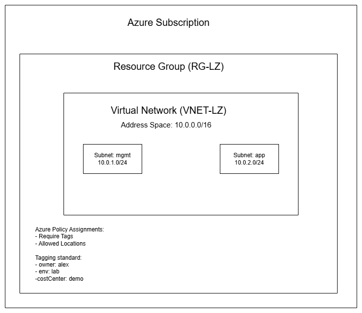

# azure-landing-zone-lite

# Azure Landing Zone Lite

A lightweight, enterprise-style Azure landing zone built with Infrastructure as Code, governance policies, and automation — designed to run entirely on free-tier Azure services.

## 🎯 Project Goals
- Demonstrate enterprise cloud architecture thinking
- Apply Infrastructure as Code (Bicep) best practices
- Enforce governance through Azure Policy and tagging
- Automate operational tasks with PowerShell
- Document everything like a real production project

## 🏗️ Architecture

## 📂 Repository Structure

## 🛠️ Tech Stack
- **Azure** — Virtual Networks, Policy, RBAC, Tags
- **Bicep** — Infrastructure as Code
- **PowerShell** — Automation scripting
- **GitHub** — Source control

## 🔑 Key Features
- Hub-style VNet with segmented subnets (mgmt + app)
- Azure Policy enforcement (required tags, allowed regions)
- RBAC model following least privilege
- Standardized tagging for cost tracking
- Automation for cost control and resource cleanup

## 🚀 Getting Started
See [docs/deployment-guide.md](docs/deployment-guide.md) for full deployment instructions.

## 💰 Cost
This project is designed to run at **$0**. See [docs/cost-control.md](docs/cost-control.md) for details.

## 📚 What I Learned
- Designing cloud foundations using hub-and-spoke principles
- Writing modular, parameterized Bicep templates
- Enforcing governance at scale through Azure Policy
- Building automation to reduce operational overhead
- Documenting infrastructure projects for team handoff

## 🗺️ Roadmap
- **Phase 1 (complete):** Single-subscription landing zone with governance
- **Phase 2:** Add Log Analytics + Azure Monitor integration
- **Phase 3:** Extend with Intune, Microsoft Defender for Endpoint, and Entra ID Conditional Access

---

*Built by Alex — Azure cloud engineering portfolio project.*
